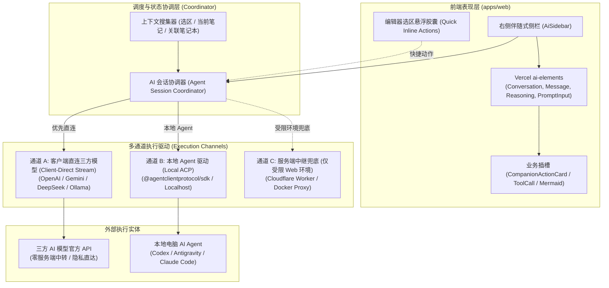
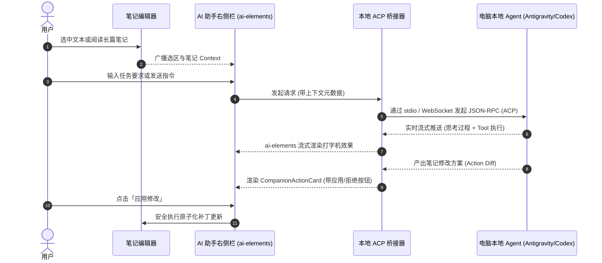

# EdgeEver AI 助手重构与本地 Agent 接入方案设计

本文档面向 EdgeEver 核心团队，梳理并评估 AI 助手交互升级、UI 组件重构、模式收敛以及本地 AI Agent（Codex、Antigravity 等）调用的落地技术方案。

---

## 1. 背景与目标

### 1.1 现状与痛点
* **浮层遮挡正文**：当前 AI 助手采用可拖拽悬浮对话框（`AiAssistantDialog.tsx`，1100+ 行代码），居中或锚定在编辑器上方，严重阻挡笔记正文与光标上下文，用户无法在长文写作时“一边参照正文一边与 AI 协作”。
* **双模式割裂（心智负担）**：界面顶部设有“问答模式”和“Agent 模式”两个切换 Tab。实际上，“问答模式”本质是单轮指令改写（翻译、润色、总结），而“Agent 模式”是带全库工具调用的多轮对话。这种人为拆分给用户带来了多余的决策负担。
* **重复造轮子**：手写了大量拖拽位移、滚动吸底、浮动层级管理、气泡渲染与输入框状态，维护成本高且未完全发挥系统内 `shadcn/ui` 与已引入的 `ai-elements` 的模块化优势。
* **孤立于本地开发/本地 Agent 生态**：用户希望在笔记中直接调用本机已经安装配置好的自主 Agent（如 Codex、Antigravity、Claude Code 等），但缺少标准化、轻量可靠的桥接路径。

### 1.2 重构目标
1. **交互形态升级**：由“居中浮动弹窗”升级为现代知识工具标准的“右侧伴随式侧边栏（Right Sidebar）”，支持宽度调节与自适应折叠。
2. **UI 组件标准化**：全面基于 Vercel `ai-elements`（与项目 `shadcn/ui` 深度整合）重构对话流、思考链（Reasoning）与状态展示，彻底消除手工样板代码。
3. **消除模式割裂**：废弃多余的“问答 vs Agent”双 Tab，统一收敛为单一且强大的全局 Companion Agent；原预置指令沉淀为 Agent 快捷技能（Skills / Slash Commands），并保留选区极速改写能力。
4. **标准化本地 Agent 接入**：采用轻量且符合行业开放标准的 **ACP (Agent Client Protocol)** 及本地服务通道，让 EdgeEver 能够丝滑调度本机已有的 AI Agent。

---

## 2. 关键技术选型与架构决策

### 决策一：采用 ACP (Agent Client Protocol) 连接本地 Agent

* **核心结论**：引入 **`@agentclientprotocol/sdk` (ACP)** 作为连接本地 Agent 的统一标准。（注：Vercel AI SDK Harness 专为云端沙箱设计，无法调度本机环境且不兼容边缘运行时，故不采用）。
* **背景与定位**：由 Zed、Anthropic（Claude Code）、JetBrains 联合制定的开放标准，定位为 AI 时代“客户端与本地 AI Agent 间的 LSP（Language Server Protocol）”。
* **通信方式**：
  * **本地子进程模式**：EdgeEver 桌面端（Node/Electron 宿主）通过 `stdio` 管道直接拉起本地 Agent（如 `antigravity`, `codex`, `claude-code`）；
  * **本地网络模式**：本地 Agent 常驻守护进程时，前端通过 `WebSocket` / `HTTP` 连接 `http://127.0.0.1:<port>`；
* **协议优势**：原生规范了会话生命周期、打字机流式、文件 Diff 审查确认、权限确认拦截与工具执行状态。
* **本地 Agent 智能嗅探（Auto-Discovery）**：
  * **免配置痛点**：用户安装了桌面 App（如 Antigravity、Codex App、WorkBuddy）后，登录态通常已保存在本地用户目录中（共享登录态），但 CLI 命令往往未注入全局 `$PATH`。
  * **主动探测**：桌面端启动时自动按优先级扫描常见路径：
    1. 检查系统环境变量 `$PATH`；
    2. 扫描 macOS 默认 App 路径（如 `/Applications/<Agent>.app/Contents/...`）；
    3. 检查用户主目录（如 `~/.local/bin/`、`~/.gemini/`、`~/.config/`）。
  * **状态可视**：探测成功直接显示 `🟢 已检测到本地 Agent (已认证)` 供用户一键选用；未找到时提供友好的“一键安装 CLI”或路径浏览指引，杜绝繁琐的手工终端配置。

---

### 决策二：基于 `ai-elements` 重构 UI 交互层

* **评估结论**：**全面拥抱 `ai-elements`**（复用仓库现存 `apps/web/src/components/ai-elements`）。
* **核心价值**：
  * 遵循项目“禁止重复造轮子、优先复用 `shadcn/ui`”的铁律。
  * `ai-elements` 专为 AI 原生设计，天然支持：
    * `<Conversation>` / `<ConversationContent>`：内置视口跟随、自动吸底（Stick-to-bottom）、滚动锚定；
    * `<Message>` / `<MessageContent>`：支持用户角色、模型角色、系统通告与富文本流式解析；
    * `<Reasoning>` / `<Thinking>`：原生可折叠的深度思考折叠面板；
    * `<PromptInput>`：带快捷发送、换行、附件与自动高度调节的现代化输入框。
* **EdgeEver 专有能力适配**：
  * **修改拦截与 Diff 卡片**：将 `CompanionActionCard`（笔记创建/更新/删除审核）以 ToolCall 卡片插槽形式嵌入消息流。
  * **富文本渲染**：消息正文无缝保留现有的 `@streamdown/mermaid` 与 `@streamdown/math`，图表与公式继续保持高质量流式排版。

---

### 决策三：从浮窗 Dialog 演进为伴随式 Right Sidebar

* **评估结论**：**全面右侧栏化**。
* **交互形态规划**：
  * **桌面大屏端**：平级停靠在编辑器右侧，构成 `[导航栏] -> [笔记列表] -> [主编辑器] -> [AI 助手侧栏]`。
    * 支持折叠/展开快捷键（默认推荐 `Cmd/Ctrl + J` 或工具栏按钮）；
    * 支持拖拽边缘调整宽度（保存至 `localStorage`，默认推荐 380px，最小 320px，最大 560px）；
    * 彻底解决遮挡问题，用户可一边阅读/编写长笔记，一边观看 AI 推理。
  * **小屏/平板/手机端**：自动响应式降级。
    * 当编辑器宽度低于阈值（例如 `< 768px`）时，侧栏转为右侧滑出抽屉（Sheet / Drawer），关闭时不占用宝贵宽度。
  * **选区感知（Context Linking）**：
    * 用户在编辑器中划选文本时，右侧栏输入框上方自动出现轻量选区徽标（如 `选中 320 字 · 当前笔记`）；
    * 用户提问时自动将选区作为上下文注入，无需二次复制粘贴。

---

### 决策四：砍掉“问答模式”，全面收敛到“统一 Agent”

* **评估结论**：**废弃模式切换 Tab，统一为 Agent 交互，通过 Skills 兼顾高频微操作**。
* **融合与收敛设计**：
  1. **主视口收敛**：删除顶部 `instruction`（问答）与 `ask`（Agent）切换栏，界面保持极简纯粹。
  2. **指令转化为 Agent Skills / 斜杠命令**：
     * 原“指令模式”下的功能（精简总结、提炼要点、全文翻译、润色表达等）沉淀为内置预置 Skills；
     * 用户在侧栏输入框输入 `/` 时，触发斜杠菜单（如 `/summarize`, `/translate`），点击即发；
     * 用户亦可直接点击输入框上方的快捷胶囊标签（Pills）一键执行。
  3. **保留编辑器行内极速微操作（防退化）**：
     * 用户选中文本后弹出的气泡菜单（Bubble Menu）中，保留最直接的快捷指令入口（例如“AI 润色”、“AI 翻译”）；
     * 极速微操作直接在行内呈现 Diff 或替换，无需强迫用户转移视线到侧栏，兼顾“复杂多轮问答”与“单点极速改写”。

---

### 决策五：三方模型 API 客户端直连优先原则（Client-Direct First）

* **核心原则**：**只要运行环境与网络支持，三方模型请求永远由客户端直接发起，坚决避免服务端做长连接中转代理。**
* **架构价值**：
  1. **零知识与极致隐私（Privacy-First）**：笔记正文与用户提示词直接发往用户配置的官方模型 API，不经过任何自建或托管服务端暂存或转发。
  2. **降低流式延迟（Lowest Latency）**：去掉了 `客户端 -> EdgeEver 服务端 -> 模型厂商` 的中间转发跳数，首字打字机延迟（TTFT）大幅优化。
  3. **保护服务器算力与带宽（Serverless-Friendly）**：彻底解耦 Cloudflare Workers / Docker 容器，服务端不被大并发的长连接 SSE 中继占用资源。
* **分端落地机制**：
  * **桌面端（Desktop App）**：通过主进程/直连网络通道彻底绕过浏览器同源策略（CORS），100% 直连所有主流厂商（OpenAI, Anthropic, Gemini, DeepSeek, Ollama 等）。
  * **移动端（Mobile App）**：React Native / 原生网络栈无 CORS 限制，直接发起模型 API 请求。
  * **Web 浏览器端**：支持 CORS 的模型 API（如 Gemini、部分兼容中转、本地 Ollama）直接发起前端 `fetch` 直连；仅在纯网页遇到严格 CORS 拦截时保留极轻量的预备协议（Prepare-Direct）。

---

## 3. 系统架构设计

### 3.1 架构分层图

### 3.2 交互时序图（本地 Agent 调度示例）

---

## 4. 变更风险与防范预案

依据 `AGENTS.md` 核心评估原则，对本次变更进行边界控制：

| 评估维度 | 详细说明 |
| :--- | :--- |
| **功能价值** | 彻底消除弹窗遮挡编辑器的交互硬伤；大幅减少手写冗余代码；统一操作心智；打通本地高阶 Agent 生态。 |
| **影响范围** | `apps/web/src/components/EditorPane.tsx` 布局容器、`apps/web/src/components/dialogs/AiAssistantDialog.tsx`（逐步废弃并替换）、`WorkspaceApp.tsx` 侧栏布局排布、i18n 多语言文案。 |
| **最坏后果** | 1. 窄屏下侧边栏挤压主编辑器可视区； 2. 移除旧问答模式导致部分习惯“单点点击替换”的用户感到路径变长； 3. 本地连接异常时出现无响应等待。 |
| **回滚与防范方案** | 1. **弹性布局**：严格设定桌面最小断点，小屏强制降级为遮罩抽屉（Drawer）； 2. **保留行内极速改写**：编辑器 Bubble Menu 保留直达轻量操作； 3. **渐进式替换**：底层 `api.streamAiGeneration` 与 `CompanionChat` 逻辑保持向前兼容，先实现并挂载新侧栏，验收无误后再清理旧 Dialog 代码； 4. **连接状态可见**：本地通道明确展示连接状态灯（Connected / Disconnected / Port）。 |
| **跨运行时验证项** | 严格禁止在核心 Server 代码中引入 Node 本地沙箱依赖，确保 Cloudflare Workers 与 Docker 镜像构建 100% 保持纯净与通过。 |

---

## 5. 分阶段实施路线图

### 第一阶段：右侧栏容器搭建与布局响应化（Foundation）
- [ ] 在 `WorkspaceApp.tsx` / `EditorPane.tsx` 建立右侧扩展面板插槽（`AiSidebar`）。
- [ ] 实现侧边栏的展开/折叠状态管理、键盘快捷键（`Cmd/Ctrl + J`）以及宽度拖拽调宽（支持 `localStorage` 记忆）。
- [ ] 完成小屏断点响应：`width < 768px` 时降级为浮动抽屉（Sheet）。

### 第二阶段：基于 `ai-elements` 重构对话流（UI Modernization）
- [ ] 封装基于 `ai-elements` 的对话主视口：`<Conversation>`, `<ConversationContent>`, `<Message>`, `<PromptInput>`。
- [ ] 将思考过程接入 `<Reasoning>` 折叠展示。
- [ ] 迁移并重构 `CompanionActionCard`，以标准工具响应卡片的形式嵌入流中，保留 Diff 对比与安全应用门禁。
- [ ] 确保正文的 `@streamdown/mermaid` 与 `@streamdown/math` 完美兼容流式解析。

### 第三阶段：模式收敛与快捷技能（Simplification）
- [ ] 移除旧界面的“问答/Agent”模式切换 Tab。
- [ ] 将常用写作指令（总结、润色、翻译等）改造为输入框快捷技能胶囊（Pills）与斜杠命令（Slash Commands）。
- [ ] 优化编辑器选区联动：选中文字即在侧栏顶部挂载 Context Badge。
- [ ] 验证多语言（zh-CN, en-US, ja, zh-TW）文案的同步清理与统一。

### 第四阶段：本地 Agent 桥接与协议接入（Local Agent Connectivity）
- [ ] 引入 `@agentclientprotocol/sdk`，在客户端封装轻量 ACP 通信适配器。
- [ ] 实现桌面端**本地 Agent 智能嗅探（Auto-Discovery）**模块：
  * 自动探测常见默认路径（`PATH`、`/Applications/<Agent>.app/...`、`~/.local/bin/`、`~/.gemini/` 等）；
  * 无缝复用本地桌面 App 已落盘的登录态，避免二次认证；
  * 提供状态灯（`🟢 已检测到本地 Agent / ⚪ 未检测到`）及一键补全指引。
- [ ] 在设置中增加“Agent 来源”选择项：
  * **内置服务模式**（默认）：继续连接当前 EdgeEver 后端 / Companion 接口；
  * **本地 Agent 模式**：优先通过智能嗅探直连，或支持手动配置本地连接地址（如 `http://127.0.0.1:xxxx`）。
- [ ] 联调本地 Agent（如 Antigravity / Codex / Claude Code），验证真实会话、文件上下文传递与修改回填。
