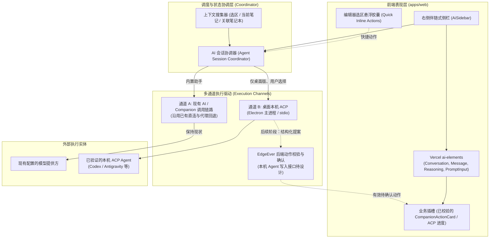
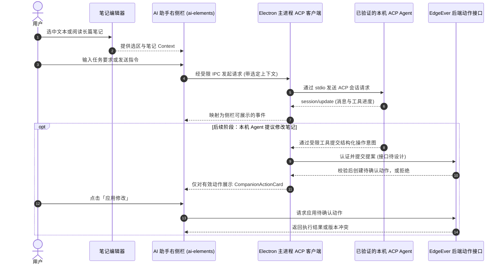

# EdgeEver AI 助手重构与本地 Agent 接入方案设计

本文档面向 EdgeEver 核心团队，梳理并评估 AI 助手交互升级、UI 组件重构、模式收敛以及本地 AI Agent（Codex、Antigravity 等）调用的落地技术方案。

---

## 1. 背景与目标

### 1.1 现状与痛点
* **浮层遮挡正文**：当前 AI 助手采用可拖拽悬浮对话框（`AiAssistantDialog.tsx`，1100+ 行代码），居中或锚定在编辑器上方，严重阻挡笔记正文与光标上下文，用户无法在长文写作时“一边参照正文一边与 AI 协作”。
* **双模式割裂（心智负担）**：界面顶部设有“问答模式”和“Agent 模式”两个切换 Tab。实际上，“问答模式”本质是单轮指令改写（翻译、润色、总结），而“Agent 模式”是带全库工具调用的多轮对话。这种人为拆分给用户带来了多余的决策负担。
* **重复造轮子**：手写了大量拖拽位移、滚动吸底、浮动层级管理、气泡渲染与输入框状态，维护成本高且未完全发挥系统内 `shadcn/ui` 与已引入的 `ai-elements` 的模块化优势。
* **孤立于本地开发/本地 Agent 生态**：用户希望在笔记中直接调用本机已经安装配置好的自主 Agent（如 Codex、Antigravity、Claude Code 等），但缺少标准化、轻量可靠的桥接路径。

### 1.2 重构目标
1. **交互形态升级**：由“居中浮动弹窗”升级为现代知识工具标准的“右侧伴随式侧边栏（Right Sidebar）”，支持宽度调节与自适应折叠。
2. **UI 组件标准化**：全面基于 Vercel `ai-elements`（与项目 `shadcn/ui` 深度整合）重构对话流、思考链（Reasoning）与状态展示，彻底消除手工样板代码。
3. **消除模式割裂**：废弃多余的“问答 vs Agent”双 Tab，统一收敛为单一且强大的全局 Companion Agent；原预置指令沉淀为 Agent 快捷技能（Skills / Slash Commands），并保留选区极速改写能力。
4. **标准化本地 Agent 接入**：采用轻量且符合行业开放标准的 **ACP (Agent Client Protocol)** 及本地服务通道，让 EdgeEver 能够丝滑调度本机已有的 AI Agent。

---

## 2. 关键技术选型与架构决策

### 决策一：采用 ACP (Agent Client Protocol) 连接本地 Agent

* **核心结论**：桌面版以 **`@agentclientprotocol/sdk` (ACP)** 作为本地 Agent 的首选接入协议。AI SDK Harness 并非不能在本机运行，但其沙箱、会话和适配层不直接解决“调用用户电脑上已配置 Agent”的需求，本阶段不引入。
* **背景与定位**：ACP 标准化客户端与 Agent 之间的会话、进度和权限交互，适合由 EdgeEver 桌面应用充当客户端。首版采用稳定的 ACP v1；是否支持某个 Agent，以具体 ACP 适配器和真实握手结果为准。[ACP 协议概览](https://agentclientprotocol.com/protocol/v1/overview)
* **通信方式**：
  * **首版本地子进程模式**：Electron 主进程启动明确支持的 ACP 服务程序，通过 JSON-RPC over `stdio` 通信，渲染进程只通过受限的 preload / IPC 接口发送请求与接收事件。Codex 对应 [codex-acp](https://github.com/agentclientprotocol/codex-acp)，Antigravity 对应 [ACP 注册表中的适配器](https://github.com/agentclientprotocol/registry/blob/main/antigravity-acp/agent.json)；普通 `codex`、`agy` 命令或已打开的桌面 App 不能直接视为 ACP 服务。其他 Agent 逐个验证后再加入。
  * **远程连接暂不纳入首版**：ACP 也面向远程场景，但 HTTP / WebSocket 的完整支持仍在演进；不让网页前端自行连接任意 `127.0.0.1` 端口。
* **协议优势与边界**：ACP 提供 `initialize`、认证协商、会话创建与可选续接、进度通知、取消及权限请求等接口；具体能力取决于 Agent 握手声明，文件 Diff 也不等于 EdgeEver 笔记修改提案。
* **本地 Agent 可用性验证**：
  * 用户选择 Agent 时，先查找已知 ACP 适配器的可执行程序，允许手动指定路径；不扫描凭据目录，也不根据某个 App 是否安装推断登录状态。
  * 通过 `initialize` 和必要的认证流程区分“程序存在”“需要登录”“可建立会话”“连接失败”。只有完成握手并成功建立会话才显示可用；复用本机登录态须逐个适配器实测。
  * 首版提供安装与配置指引；自动下载或安装可执行程序留待来源校验、更新和跨平台策略明确之后。

---

### 决策二：基于 `ai-elements` 重构 UI 交互层

* **评估结论**：**全面拥抱 `ai-elements`**（复用仓库现存 `apps/web/src/components/ai-elements`）。
* **核心价值**：
  * 遵循项目“禁止重复造轮子、优先复用 `shadcn/ui`”的铁律。
  * `ai-elements` 专为 AI 原生设计，天然支持：
    * `<Conversation>` / `<ConversationContent>`：内置视口跟随、自动吸底（Stick-to-bottom）、滚动锚定；
    * `<Message>` / `<MessageContent>`：支持用户角色、模型角色、系统通告与富文本流式解析；
    * `<Reasoning>` / `<Thinking>`：原生可折叠的深度思考折叠面板；
    * `<PromptInput>`：带快捷发送、换行、附件与自动高度调节的现代化输入框。
* **EdgeEver 专有能力适配**：
  * **修改拦截与 Diff 卡片**：保留 `CompanionActionCard` 作为业务卡片，只展示由 EdgeEver 后端创建并校验的待确认动作。ACP 工具事件与文件 Diff 可以展示执行进度，但不能直接转换成可应用的笔记动作。
  * **富文本渲染**：消息正文无缝保留现有的 `@streamdown/mermaid` 与 `@streamdown/math`，图表与公式继续保持高质量流式排版。

---

### 决策三：从浮窗 Dialog 演进为伴随式 Right Sidebar

* **评估结论**：**全面右侧栏化**。
* **交互形态规划**：
  * **桌面大屏端**：平级停靠在编辑器右侧，构成 `[导航栏] -> [笔记列表] -> [主编辑器] -> [AI 助手侧栏]`。
    * 支持折叠/展开快捷键（默认推荐 `Cmd/Ctrl + J` 或工具栏按钮）；
    * 支持拖拽边缘调整宽度（保存至 `localStorage`，默认推荐 380px，最小 320px，最大 560px）；
    * 彻底解决遮挡问题，用户可一边阅读/编写长笔记，一边观看 AI 推理。
  * **小屏/平板/手机端**：自动响应式降级。
    * 当编辑器宽度低于阈值（例如 `< 768px`）时，侧栏转为右侧滑出抽屉（Sheet / Drawer），关闭时不占用宝贵宽度。
  * **选区感知（Context Linking）**：
    * 用户在编辑器中划选文本时，右侧栏输入框上方自动出现轻量选区徽标（如 `选中 320 字 · 当前笔记`）；
    * 用户提问时自动将选区作为上下文注入，无需二次复制粘贴。

---

### 决策四：砍掉“问答模式”，全面收敛到“统一 Agent”

* **评估结论**：**废弃模式切换 Tab，统一为 Agent 交互，通过 Skills 兼顾高频微操作**。
* **融合与收敛设计**：
  1. **主视口收敛**：删除顶部 `instruction`（问答）与 `ask`（Agent）切换栏，界面保持极简纯粹。
  2. **指令转化为 Agent Skills / 斜杠命令**：
     * 原“指令模式”下的功能（精简总结、提炼要点、全文翻译、润色表达等）沉淀为内置预置 Skills；
     * 用户在侧栏输入框输入 `/` 时，触发斜杠菜单（如 `/summarize`, `/translate`），点击即发；
     * 用户亦可直接点击输入框上方的快捷胶囊标签（Pills）一键执行。
  3. **保留编辑器行内极速微操作（防退化）**：
     * 用户选中文本后弹出的气泡菜单（Bubble Menu）中，保留最直接的快捷指令入口（例如“AI 润色”、“AI 翻译”）；
     * 极速微操作直接在行内呈现 Diff 或替换，无需强迫用户转移视线到侧栏，兼顾“复杂多轮问答”与“单点极速改写”。

---

### 现有模型调用链路（不属于本次重构）

EdgeEver 的 `packages/client/src/index.ts` 已实现模型 API 直连、浏览器端 CORS 探测及服务端代理回退；Companion 也已有相应的准备、执行和检查点接口。本方案沿用这条链路，不新增“客户端永远直连”的原则，不改变凭据准备、服务端工具调用或回退行为。模型请求是否经过实例服务端，取决于运行环境、模型提供方和当前调用路径；隐私、延迟与带宽效果需按实际路径测量，不能一概保证。

---

## 3. 系统架构设计

### 3.1 架构分层图

### 3.2 交互时序图（本地 Agent 调度示例）

本机 ACP 首版仅向 Agent 提供用户选定的只读笔记上下文，不提供写入 EdgeEver 的工具；Agent 自身的本机工具权限另按其适配器配置。ACP 的工具事件或文件 Diff 不会自动成为 EdgeEver 笔记操作；开放笔记写入前必须另行设计受限工具、结构化提案、工作区权限、笔记版本校验和服务端确认接口，禁止本机 Agent 绕过现有门禁直接改写笔记。

---

## 4. 变更风险与防范预案

依据 `AGENTS.md` 核心评估原则，对本次变更进行边界控制：

| 评估维度 | 详细说明 |
| :--- | :--- |
| **功能价值** | 彻底消除弹窗遮挡编辑器的交互硬伤；大幅减少手写冗余代码；统一操作心智；打通本地高阶 Agent 生态。 |
| **影响范围** | `apps/web/src/components/EditorPane.tsx` 布局容器、`apps/web/src/components/dialogs/AiAssistantDialog.tsx`（逐步废弃并替换）、`WorkspaceApp.tsx` 侧栏布局排布、i18n 多语言文案。 |
| **最坏后果** | 1. 窄屏下侧边栏挤压主编辑器可视区； 2. 移除旧问答模式导致部分习惯“单点点击替换”的用户感到路径变长； 3. 本地连接异常时出现无响应等待； 4. 若错误地将本机 Agent 输出当成可信笔记动作，可能覆盖旧内容或绕过写入确认。 |
| **回滚与防范方案** | 1. **弹性布局**：严格设定桌面最小断点，小屏强制降级为遮罩抽屉（Drawer）； 2. **保留行内极速改写**：编辑器 Bubble Menu 保留直达轻量操作； 3. **渐进式替换**：底层 `api.streamAiGeneration` 与 `CompanionChat` 逻辑保持向前兼容，先实现并挂载新侧栏，验收无误后再清理旧 Dialog 代码； 4. **连接状态可见**：本地通道区分程序未找到、需要登录、会话可用和连接失败。 |
| **跨运行时验证项** | 严格禁止在核心 Server 代码中引入 Node 本地沙箱依赖，确保 Cloudflare Workers 与 Docker 镜像构建 100% 保持纯净与通过。 |

---

## 5. 分阶段实施路线图

### 第一阶段：右侧栏容器搭建与布局响应化（Foundation）
- [ ] 在 `WorkspaceApp.tsx` / `EditorPane.tsx` 建立右侧扩展面板插槽（`AiSidebar`）。
- [ ] 实现侧边栏的展开/折叠状态管理、键盘快捷键（`Cmd/Ctrl + J`）以及宽度拖拽调宽（支持 `localStorage` 记忆）。
- [ ] 完成小屏断点响应：`width < 768px` 时降级为浮动抽屉（Sheet）。

### 第二阶段：基于 `ai-elements` 重构对话流（UI Modernization）
- [ ] 封装基于 `ai-elements` 的对话主视口：`<Conversation>`, `<ConversationContent>`, `<Message>`, `<PromptInput>`。
- [ ] 将思考过程接入 `<Reasoning>` 折叠展示。
- [ ] 将 `CompanionActionCard` 作为后端已校验动作的业务卡片嵌入消息流，保留 Diff 对比与安全应用门禁；ACP 工具进度另行呈现。
- [ ] 确保正文的 `@streamdown/mermaid` 与 `@streamdown/math` 完美兼容流式解析。

### 第三阶段：模式收敛与快捷技能（Simplification）
- [ ] 移除旧界面的“问答/Agent”模式切换 Tab。
- [ ] 将常用写作指令（总结、润色、翻译等）改造为输入框快捷技能胶囊（Pills）与斜杠命令（Slash Commands）。
- [ ] 优化编辑器选区联动：选中文字即在侧栏顶部挂载 Context Badge。
- [ ] 验证多语言（zh-CN, en-US, ja, zh-TW）文案的同步清理与统一。

### 第四阶段：本地 Agent 桥接与协议接入（Local Agent Connectivity）
- [ ] 引入 `@agentclientprotocol/sdk`，在 Electron 主进程封装 ACP v1 `stdio` 客户端，并通过受限 preload / IPC 向侧栏传递事件。
- [ ] 实现桌面端**本机 ACP Agent 可用性验证**：
  * 只查找明确支持的 ACP 适配器可执行程序，并允许用户手动指定路径；不读取登录凭据目录。
  * 完成 `initialize`、必要的认证流程与会话创建，再显示“可用”；分别展示未安装、需登录、连接失败等状态。
  * 首版提供安装与配置指引，不自动下载或安装二进制程序；按平台验证登录态是否能够复用。
- [ ] 在设置中增加“Agent 来源”选择项：
  * **内置服务模式**（默认）：继续连接当前 EdgeEver 后端 / Companion 接口；
  * **本地 Agent 模式**：桌面版从已验证的 ACP 适配器中选择，支持手动指定适配器程序路径；首版不接受任意本地网络地址。
- [ ] 分别联调 Codex 与 Antigravity 的 ACP 适配器，验证握手、认证、真实会话、流式事件、取消和只读笔记上下文；其他 Agent 通过同样的验证后再加入。
- [ ] 若后续开放本机 Agent 修改笔记，先完成服务端结构化提案与确认门禁设计，并验证版本冲突与失败恢复；不得将 ACP 文件 Diff 直接交给编辑器写入。
